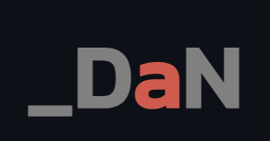

 

# Hi there! 

My name is Daniel Akproh and I'm a robotics engineer/software developer. I find computers fascinating and I spend my spare times learning about and playing with them.

## Technologies & Tools:hammer_and_wrench:

## Blog & Writing:memo:

Apart from coding, I also try to write technical blogs about computer algorithms and teach young students how to code on the weekends - you can find my articles on my LinkedIn [here](https://www.linkedin.com/in/danielakproh/).

A sample of my recent articles:

<!-- BLOG-POST-LIST:START -->
- [Two Number Sum Leetcode Challenge](https://www.linkedin.com/pulse/two-number-sum-daniel-akproh/)
- [House Robber Leetcode Challenge](https://www.linkedin.com/pulse/house-robber-daniel-akproh/)
<!-- BLOG-POST-LIST:END -->

## My Latest project:computer:
<a href="https://github.com/danielakproh/sorting-visualizer/">Sorting Visualizer in Python</a>   

<!-- Resources -->
<!-- Icons: https://simpleicons.org/ -->
<!-- GitHub Stats: https://github.com/anuraghazra/github-readme-stats -->
<!-- Emojis: https://emojipedia.org/emoji/ -->
<!-- HTML Emojis: https://www.fileformat.info/index.htm -->
<!-- Shields: https://shields.io/ -->
<!-- Awesome GitHub Profile README: https://github.com/abhisheknaiidu/awesome-github-profile-readme -->
